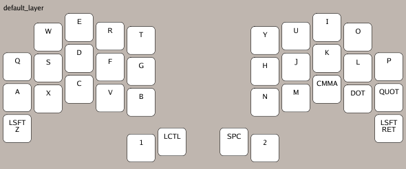
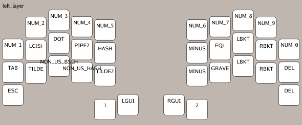
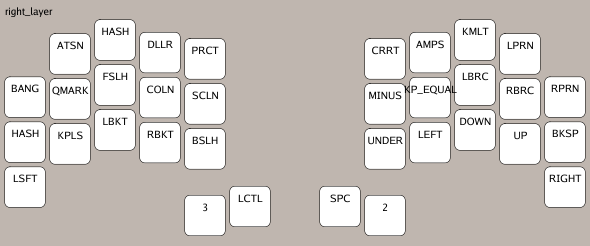
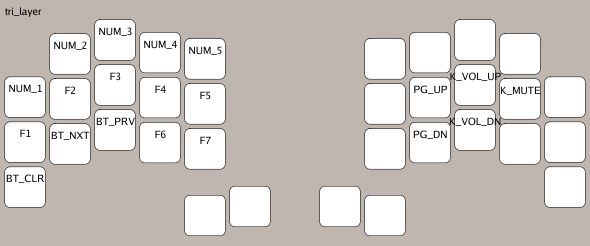

# My ZMK Config

This is my custom configuration of ZMK for my keyboard. Currently using ferris sweep from benvallack https://github.com/benvallack/Ferris-Sweep-Tweaked.

# Layout

Images generated with [zmk-viewer](https://github.com/MrMarble/zmk-viewer)